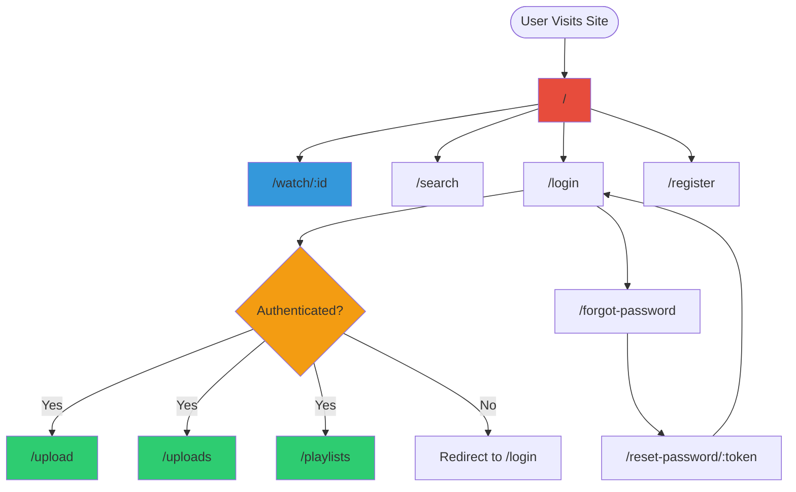
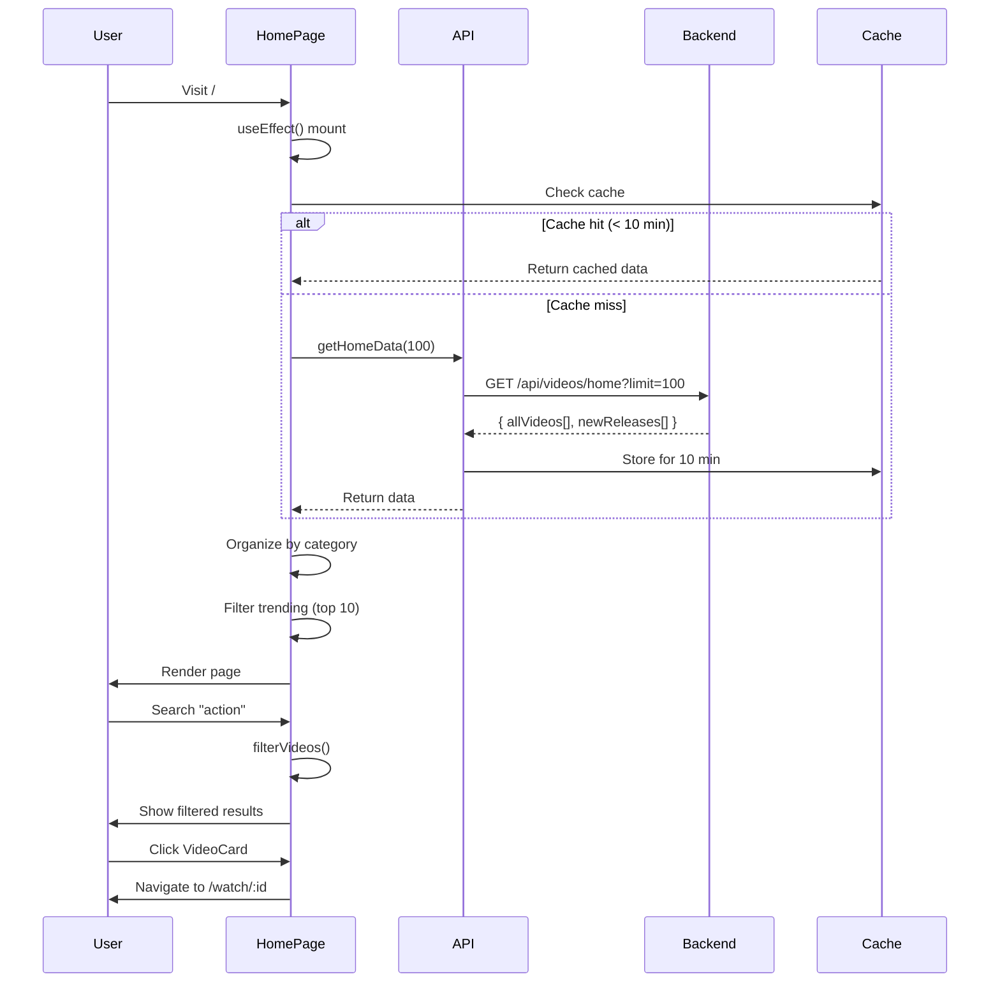
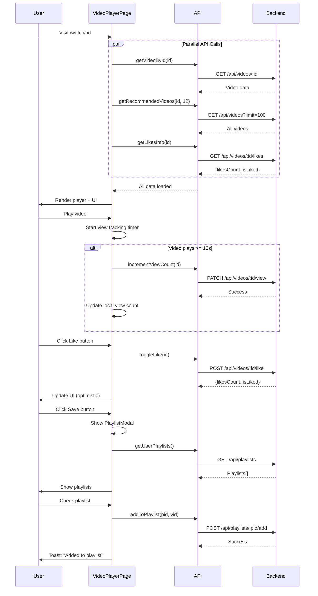
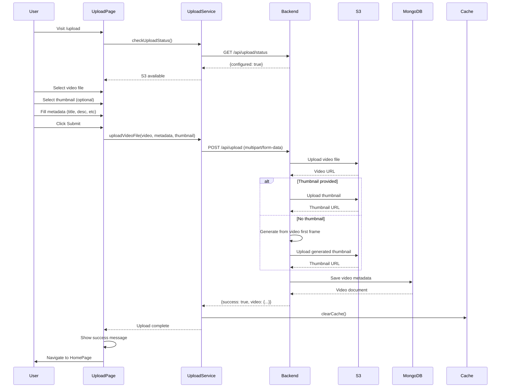
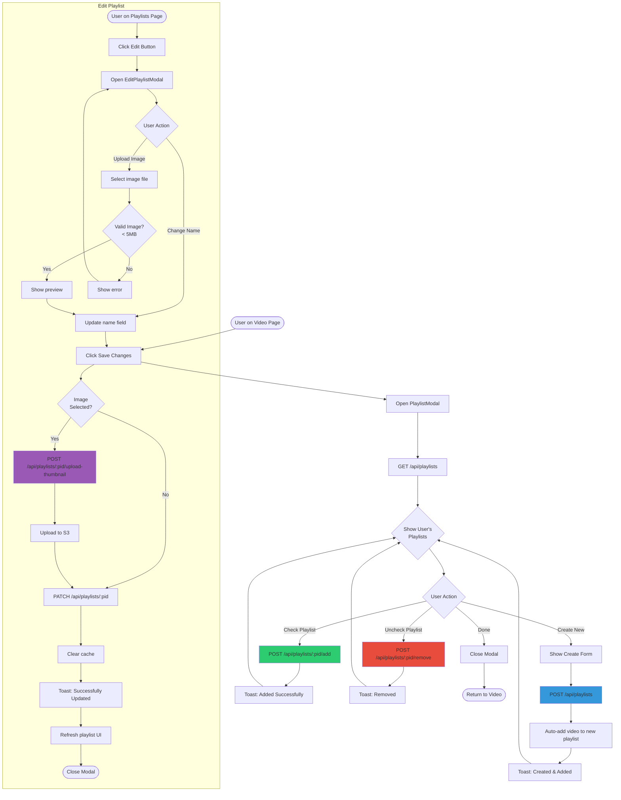
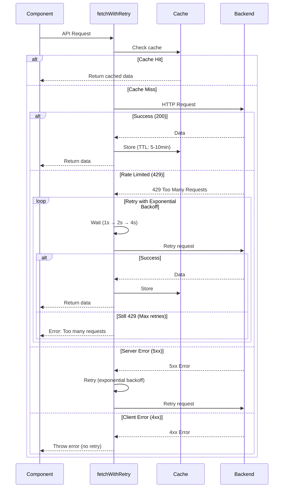
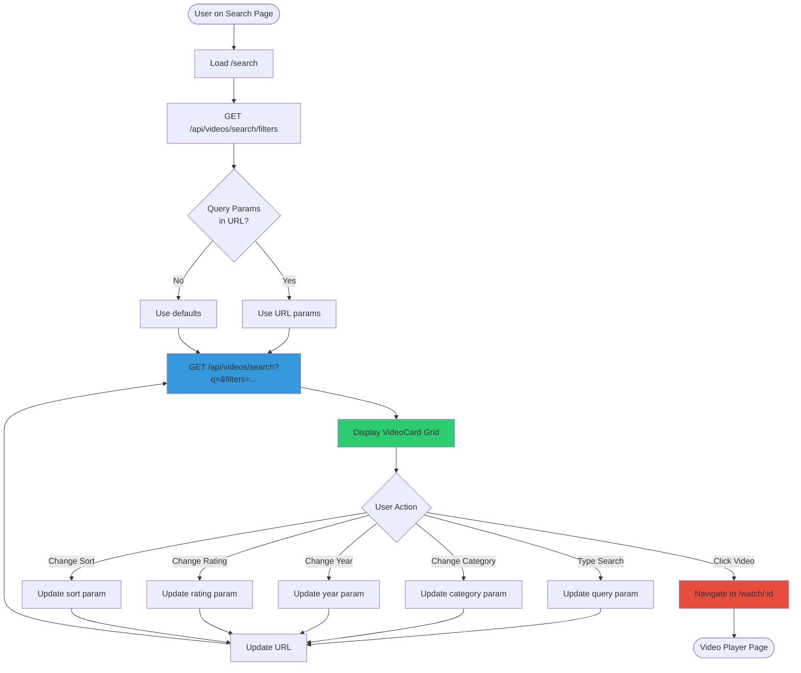

# ReactFlix - Flow Diagrams

## 1. Application Routing Structure



---

## 2. Component Hierarchy

```mermaid
graph TD
    App[App.jsx] --> EB[ErrorBoundary]
    App --> TC[ToastContainer]
    App --> Router[React Router]
    
    Router --> HomePage[HomePage]
    Router --> VideoPlayerPage[VideoPlayerPage]
    Router --> SearchPage[SearchPage]
    Router --> UploadPage[UploadPage]
    Router --> UploadsPage[UploadsPage]
    Router --> PlaylistsPage[PlaylistsPage]
    Router --> AuthPages[Auth Pages]
    
    HomePage --> Nav1[Navbar]
    HomePage --> Hero[HeroSection]
    HomePage --> Car1[Carousel: Trending]
    HomePage --> Car2[Carousel: New Releases]
    HomePage --> Grid1[Browse All Grid]
    
    Car1 --> VC1[VideoCard]
    Car2 --> VC2[VideoCard]
    Grid1 --> VC3[VideoCard]
    
    VideoPlayerPage --> Nav2[Navbar]
    VideoPlayerPage --> VP[Video Player]
    VideoPlayerPage --> CS[CommentsSection]
    VideoPlayerPage --> PM[PlaylistModal]
    VideoPlayerPage --> RecGrid[Recommendations]
    RecGrid --> VC4[VideoCard]
    
    PlaylistsPage --> Nav3[Navbar]
    PlaylistsPage --> EPM[EditPlaylistModal]
    PlaylistsPage --> PLCards[Playlist Cards]
    
    SearchPage --> Nav4[Navbar]
    SearchPage --> SResults[Search Results]
    SResults --> VC5[VideoCard]
    
    UploadPage --> Nav5[Navbar]
    UploadPage --> UForm[Upload Form]
    
    style HomePage fill:#e74c3c,color:#fff
    style VideoPlayerPage fill:#3498db,color:#fff
    style PlaylistsPage fill:#2ecc71,color:#fff
    style SearchPage fill:#9b59b6,color:#fff
```



---

## 3. Data Flow - HomePage



---

## 4. Data Flow - VideoPlayerPage



---

## 5. Authentication Flow

```mermaid
flowchart TD
    Start([User Action]) --> LoginCheck{Already<br/>Logged In?}
    
    LoginCheck -->|Yes| Dashboard[Access Protected Route]
    LoginCheck -->|No| LoginPage[Show Login Page]
    
    LoginPage --> LoginForm{Login or<br/>Register?}
    
    LoginForm -->|Login| LoginAPI[POST /api/auth/login]
    LoginForm -->|Register| RegisterAPI[POST /api/auth/register]
    LoginForm -->|Forgot Password| ForgotPW[POST /api/auth/forgot-password]
    
    LoginAPI --> ValidateLogin{Valid<br/>Credentials?}
    RegisterAPI --> ValidateReg{Valid<br/>Input?}
    ForgotPW --> EmailSent[Email Sent with Token]
    
    ValidateLogin -->|Yes| GetToken[Receive JWT Token]
    ValidateLogin -->|No| LoginError[Show Error]
    
    ValidateReg -->|Yes| GetToken
    ValidateReg -->|No| RegError[Show Error]
    
    GetToken --> StoreToken[Store in localStorage]
    StoreToken --> RedirectIntended[Redirect to Intended Page]
    RedirectIntended --> Dashboard
    
    LoginError --> LoginPage
    RegError --> LoginPage
    
    EmailSent --> CheckEmail{User Checks<br/>Email}
    CheckEmail --> ClickLink[Click Reset Link]
    ClickLink --> ResetPage[/reset-password/:token]
    ResetPage --> NewPassword[Enter New Password]
    NewPassword --> ResetAPI[POST /api/auth/reset-password/:token]
    ResetAPI --> ValidateReset{Valid<br/>Token?}
    ValidateReset -->|Yes| Success[Password Updated]
    ValidateReset -->|No| ResetError[Show Error]
    Success --> LoginPage
    ResetError --> ResetPage
    
    Dashboard --> Logout{User<br/>Logout?}
    Logout -->|Yes| ClearStorage[Clear localStorage]
    ClearStorage --> Start
    
    style GetToken fill:#2ecc71
    style Dashboard fill:#3498db
    style LoginError fill:#e74c3c
    style RegError fill:#e74c3c
```

---

## 6. Video Upload Flow



---

## 7. Playlist Management Flow



---

## 8. API Service Architecture

```mermaid
graph TB
    subgraph Frontend
        Components[React Components]
        API[api.js]
        Auth[authService.js]
        Upload[uploadService.js]
        Retry[fetchWithRetry.js]
        Cache[In-Memory Cache]
    end
    
    subgraph Utilities
        Retry --> |Exponential<br/>Backoff| Retry
        Cache --> |10 min TTL| Cache
    end
    
    Components --> API
    Components --> Auth
    Components --> Upload
    
    API --> Retry
    Retry --> Cache
    
    Cache --> |Cache Miss| Backend
    Cache --> |Cache Hit| Components
    
    subgraph Backend
        Express[Express Server]
        VideoRoutes[/api/videos/*]
        AuthRoutes[/api/auth/*]
        PlaylistRoutes[/api/playlists/*]
        UploadRoutes[/api/upload]
        
        Express --> VideoRoutes
        Express --> AuthRoutes
        Express --> PlaylistRoutes
        Express --> UploadRoutes
    end
    
    subgraph Data Layer
        MongoDB[(MongoDB)]
        S3[(AWS S3)]
        
        VideoRoutes --> MongoDB
        PlaylistRoutes --> MongoDB
        UploadRoutes --> S3
        UploadRoutes --> MongoDB
    end
    
    Retry --> Express
    Auth --> Express
    Upload --> Express
    
    style API fill:#3498db
    style Auth fill:#e74c3c
    style Upload fill:#2ecc71
    style Retry fill:#f39c12
    style Cache fill:#9b59b6
```

---

## 9. Rate Limit Handling with Retry Logic



---

## 10. Search & Filter Flow



---

## Usage Instructions

1. Copy any diagram above
2. Paste into a Mermaid editor (e.g., [Mermaid Live Editor](https://mermaid.live/))
3. Export as PNG/SVG for documentation
4. Or embed directly in GitHub README (GitHub supports Mermaid)

Example usage in README:

\`\`\`mermaid
// Paste diagram code here
\`\`\`

---

**Note:** These diagrams complement the detailed `REACTFLIX_FLOW_DIAGRAM.md` documentation.

